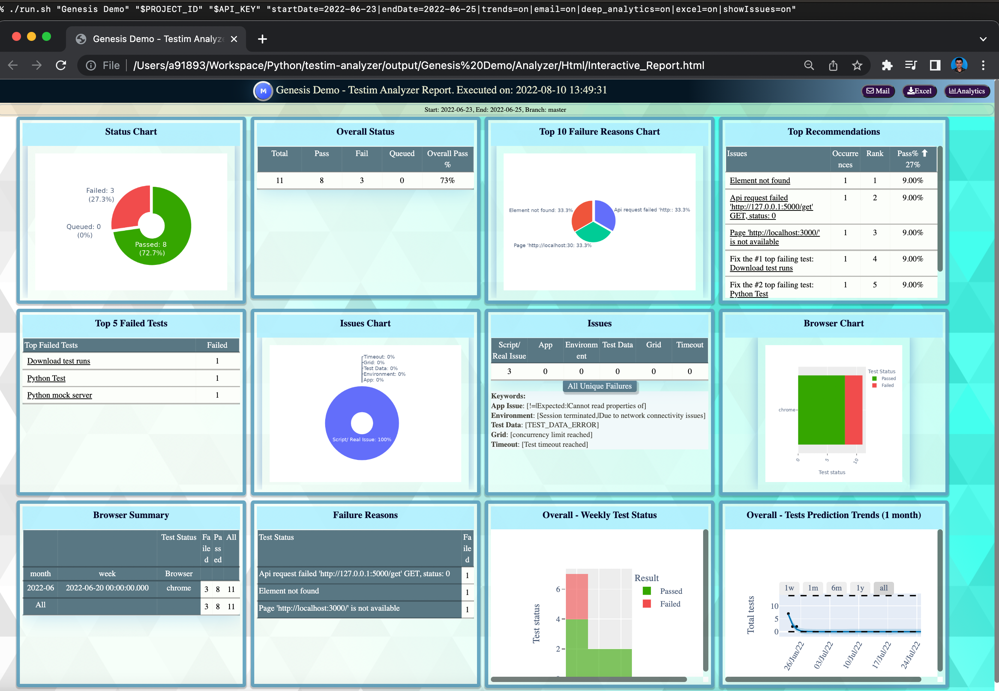

# Testim Failure Analyzer

  This is a fully responsive, interactive, predictive, mobile friendly, emailable, auto generated website that has the ability to analyze failed tests results and provide meaningful insights, create individual testim reports with screenshots & video.

**Disclaimer**: This project is provided "AS IS". It is not officially supported by Testim.

**Table of contents:**

- [Testim Failure Analyzer](#testim-failure-analyzer)
- [Pre-requisite:](#pre-requisite)
  - [Windows:](#windows)
  - [Mac:](#mac)
- [Steps to execute:](#steps-to-execute)
  - [Mac:](#mac-1)
  - [Windows: </br>](#windows-br)
- [Analyze Test runs:](#analyze-test-runs)
  - [Via downloaded Test runs csv:](#via-downloaded-test-runs-csv)
    - [High level analysis:](#high-level-analysis)
    - [In-depth Analysis:](#in-depth-analysis)
  - [Via Testim API based on:](#via-testim-api-based-on)
    - [Dates:](#dates)
    - [Execution id/ run id:](#execution-id-run-id)
      - [single:](#single)
      - [multiple:](#multiple)
    - [Execution name:](#execution-name)
      - [single:](#single-1)
      - [multiple:](#multiple-1)
    - [In-depth Analysis:  </br>](#in-depth-analysis--br)
  - [Advanced Customizations:](#advanced-customizations)
- [Generate standalone reports:](#generate-standalone-reports)
  - [Via downloaded test runs csv (Both Passed & Failed tests)](#via-downloaded-test-runs-csv-both-passed--failed-tests)
  - [Via API: (Only failed tests)](#via-api-only-failed-tests)
    - [based on dates:](#based-on-dates)
    - [single execution name:](#single-execution-name)
    - [single result id:  (Both Passed & Failed tests)](#single-result-id--both-passed--failed-tests)
    - [multiple result ids:  (Both Passed & Failed tests)](#multiple-result-ids--both-passed--failed-tests)


# Pre-requisite:

- Install docker.<br>
- Download/ clone [this](https://github.com/genesisthomas/testim-analyzer) github project. </br>

## Windows:
- Install [git](https://stackoverflow.com/questions/26522789/how-to-run-sh-on-windows-command-prompt)</br>
  
## Mac: 
- Open terminal navigate to folder where run.sh is present & run the below command:</br>
```sh
chmod +x ./run.sh
``` 
<br>

# Steps to execute:

- Enter the following commands in terminal/ command prompt & then **choose** your preferred parameters from the following **sections** to **analyze** test runs/ **download** single reports with screenshots & videos.
  
## Mac:
```sh
./run.sh "<PROJECT_NAME>" "<PROJECT_ID>" "<API_KEY>" 
```
## Windows: </br>
```sh
sh run.sh "<PROJECT_NAME>" "<PROJECT_ID>" "<API_KEY>" 
```


</br>

**Notes:**

- 1st argument: Replace `<PROJECT_NAME>` with your testim project name.
- 2nd argument: Replace `<PROJECT_ID>` with your testim project id.
- 3rd argument: Replace `<API_KEY>` with [Testim's API Key](https://help.testim.io/docs/api-access#enabling-api-access).

<p></br>

# Analyze Test runs:

## Via downloaded Test runs csv:

**Pre-requisite: Download the required test runs csv file to the current working directory.**

</br> 

### High level analysis:
```sh
"csvFile=on"
```

### In-depth Analysis:
```sh
"csvFile=on|trends=on|email=on|deep_analytics=on|excel=on|showIssues=on"
```

**Notes:**
- 4th argument: csvFile=on will analyze any test runs csv file present in the current working directory. 
- There are other configurable filters/ options to enable advanced analysis.

<p></br>

## Via Testim API based on:

**Note:** Change branch as applicable.</br> 
</br> 

### Dates:
```sh
"startDate=2022-07-12|endDate=2022-07-12|branch=master"
```
</br> 

### Execution id/ run id:
#### single:
```sh
"runId=hKqljO1q6WMi8KJn|startDate=2022-06-23|endDate=2022-06-23|branch=master"
```

#### multiple:
```sh
"runId=Om9t9C4MAXZAuOPE;hKqljO1q6WMi8KJn|startDate=2022-06-23|endDate=2022-06-27|branch=master"
```
</br> 

### Execution name:
#### single:
```sh
"executionName=pass, fail & skip|startDate=2022-06-23|endDate=2022-06-23|branch=master"
```
#### multiple:

```sh
"executionName=pass, fail & skip;Testim Booking Smoke Web|startDate=2022-06-23|endDate=2022-06-23|branch=master"
```
</br> 


### In-depth Analysis:  </br>

**Note:** Can be combined with above options
</br>
```sh
"startDate=2022-06-23|endDate=2022-06-23|trends=on|email=on|deep_analytics=on|excel=on|showIssues=on"
```

**Notes:**
- 4th argument: Corresponds to configurable filters/ options to enable advanced analysis.
<p></br>

**Screenshot:** </br> </br>


## Advanced Customizations:

Change the background color, debug with logs, customize logo & custom version number in heading by editing the **run.sh** after -a params with the below **bold** bold text:

    `testim-analyzer:latest -n "${NAME}" -a "${PARAMS}"` **-b white -d true -l www.wikipedia.org -v 1.0**
<p></br>

# Generate standalone reports:

## Via downloaded test runs csv (Both Passed & Failed tests)
```sh
"csvFile=on|singleReport=on"
```
</br>

## Via API: (Only failed tests)

**Note:** Change branch as applicable.</br> </br> 

### based on dates:
```sh
"singleReport=on|startDate=2022-07-12|endDate=2022-07-12|branch=master"
```
</br>

### single execution name:
```sh
"singleReport=on|executionName=pass, fail & skip|startDate=2022-06-23|endDate=2022-06-23|branch=master"
```
</br>

### single result id:  (Both Passed & Failed tests)
```sh
"singleReport=on|resultId=bIXYH4A51vScEg2i"
```
</br>

### multiple result ids:  (Both Passed & Failed tests)
```sh
"singleReport=on|resultId=h9QQu5ehaOF0dqyM;DA0kHuTMG204Da16"
```
</br>

**Screenshot:** </br> </br>

