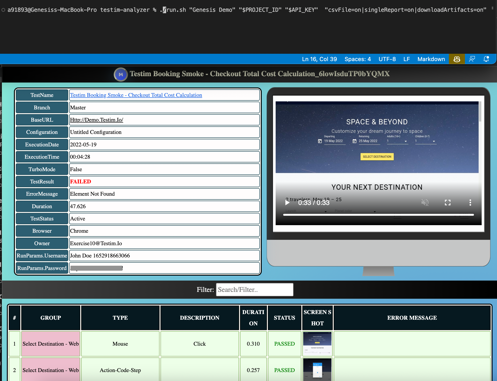

# Testim Failure Analyzer

  This is a fully responsive, interactive, predictive, mobile friendly, emailable, auto generated website that has the ability to analyze failed tests results and provide meaningful insights, create individual testim reports with screenshots & video.

**Disclaimer**: This project is provided "AS IS". It is not officially supported by Testim.

**Table of contents:**
- [Testim Failure Analyzer](#testim-failure-analyzer)
- [Pre-requisite:](#pre-requisite)
  - [Windows:](#windows)
  - [Mac:](#mac)
- [Steps to execute:](#steps-to-execute)
  - [Mac:](#mac-1)
  - [Windows: </br>](#windows-br)
- [Analyze Test Runs:](#analyze-test-runs)
  - [via downloaded Test Runs csv:](#via-downloaded-test-runs-csv)
    - [in-depth analysis:](#in-depth-analysis)
    - [high level analysis:](#high-level-analysis)
  - [via Testim API:](#via-testim-api)
    - [in-depth analysis:  </br>](#in-depth-analysis--br)
    - [high level analysis:](#high-level-analysis-1)
      - [dates:](#dates)
      - [execution id/ run id:](#execution-id-run-id)
      - [execution name:](#execution-name)
      - [result label:](#result-label)
  - [Advanced Customizations:](#advanced-customizations)
- [Generate standalone reports:](#generate-standalone-reports)
  - [without downloaded screenshots & video:](#without-downloaded-screenshots--video)
    - [for both passed & failed tests:](#for-both-passed--failed-tests)
      - [via report-file from testim CLI/ docker:](#via-report-file-from-testim-cli-docker)
      - [via downloaded test runs csv:](#via-downloaded-test-runs-csv-1)
      - [via API result id:](#via-api-result-id)
    - [for failed tests only via API:](#for-failed-tests-only-via-api)
      - [dates:](#dates-1)
      - [execution name:](#execution-name-1)
      - [execution id/ run id:](#execution-id-run-id-1)
  - [with downloaded screenshots & video:](#with-downloaded-screenshots--video)

# Pre-requisite:

- Install docker.<br>
- Download/ clone [this](https://github.com/genesisthomas/testim-analyzer) github project. </br>

## Windows:
- Install [git](https://stackoverflow.com/questions/26522789/how-to-run-sh-on-windows-command-prompt)</br>
  
## Mac: 
- Open terminal navigate to folder where run.sh is present & run the below command:</br>
```sh
chmod +x ./run.sh
``` 
<br>

# Steps to execute:

- Enter the following commands in terminal/ command prompt & then **choose** your preferred parameters from the following **sections** to **analyze** test runs/ **download** single reports with screenshots & videos.
  
## Mac:
```sh
./run.sh "<PROJECT_NAME>" "<PROJECT_ID>" "<API_KEY>" 
```
## Windows: </br>
```sh
sh run.sh "<PROJECT_NAME>" "<PROJECT_ID>" "<API_KEY>" 
```


</br>

**notes:**

- 1st argument: Replace `<PROJECT_NAME>` with your testim project name.
- 2nd argument: Replace `<PROJECT_ID>` with your testim project id.
- 3rd argument: Replace `<API_KEY>` with [Testim's API Key](https://help.testim.io/docs/api-access#enabling-api-access).

<p></br>

# Analyze Test Runs:

## via downloaded Test Runs csv:

**Pre-requisite: Download the required test runs csv file to the current working directory.**

</br> 

### in-depth analysis:
```sh
"csvFile=on|trends=on|email=on|deep_analytics=on|excel=on|showIssues=on"
```

### high level analysis:
```sh
"csvFile=on"
```

**notes:**
- 4th argument: csvFile=on will analyze any test runs csv file present in the current working directory. 
- There are other configurable filters/ options to enable advanced analysis.

<p></br>

## via Testim API:

**Note:** Change branch as applicable.</br> 
</br> 


### in-depth analysis:  </br>

**Note:** Append `|trends=on|email=on|deep_analytics=on|excel=on|showIssues=on` with any of the below options. E.g. (Dates)
</br>
```sh
"startDate=2022-06-23|endDate=2022-06-23|branch=master|trends=on|email=on|deep_analytics=on|excel=on|showIssues=on"
```

### high level analysis: 

#### dates:
```sh
"startDate=2022-07-12|endDate=2022-07-12|branch=master"
``` 
</br> 

#### execution id/ run id:
```sh
"runId=hKqljO1q6WMi8KJn|startDate=2022-06-23|endDate=2022-06-23|branch=master"
```
notes:</br>
- RunId can be retrieved from single execution details view url (after suites/)</br>
- Supports more than one runId seperated by semicolon.</br></br>

#### execution name:

```sh
"executionName=pass, fail & skip|startDate=2022-06-23|endDate=2022-06-23|branch=master"
```
notes:</br>
- executionName can be retrieved from Testim's Executions page</br>
- Supports more than one executionName seperated by semicolon.</br></br>

#### result label:

```sh
"resultLabel=pass, fail & skip|startDate=2022-06-23|endDate=2022-06-23|branch=master"
```
notes:</br>
- Refer [here](https://help.testim.io/docs/result-labels) to add result labels to your tests.
- resultLabel can be retrieved from Testim's Executions page</br>
- Supports more than one resultLabel seperated by semicolon.</br></br>
</br> 

**Screenshot:** </br> </br>


## Advanced Customizations:

Change the background color, debug with logs, customize logo & custom version number in heading by editing the **run.sh** after -a params with the below **bold** bold text:

    `testim-analyzer:latest -n "${NAME}" -a "${PARAMS}"` **-b white -d true -l www.wikipedia.org -v 1.0**
<p></br>

# Generate standalone reports:

- Create standalone test reports with test info, test params, steps info, filter option, option to download screenshots & create a standalone report with screenshots & stitched together video. 
- Each Screenshot can be zoomed in and clicked to view full screen. 
- Table colors change based on Test status & Groups. </br>

##  without downloaded screenshots & video:
### for both passed & failed tests: 

#### via report-file from testim CLI/ docker:

**Prerequisite**: Run testim [CLI](https://help.testim.io/docs/the-command-line-cli) or [docker](https://help.testim.io/docs/jenkins-integration-using-docker) with an additional parameter: `-r ~/report.xml`

```sh
"singleReport=on|reportFile=./report.xml"
```

notes:</br>
- reportFile value corresponds to the report path mentioned with `-r ` of testim [CLI](https://help.testim.io/docs/the-command-line-cli) or [docker](https://help.testim.io/docs/jenkins-integration-using-docker)  </br>

</br>

#### via downloaded test runs csv: 
**Pre-requisite: Download the required test runs csv file to the current working directory.**
```sh
"csvFile=on|singleReport=on"
```
**Note:** 
- Uses direct screenshot urls with a default validity of 30 days. 
</br></br>

  
#### via API result id:
```sh
"singleReport=on|resultId=bIXYH4A51vScEg2i"
```
notes:</br>
- Use this only when you want to download individual reports. Prefer to generate via report-file if executed from CLI/CI.
- resultId can be retrieved from single report url (after result-id=). </br>
- Supports more than one resultId seperated by semicolon.</br></br>

### for failed tests only via API: 
**Note:** Change **branch** as applicable.</br> </br> 

#### dates:

```sh
"singleReport=on|startDate=2022-07-12|endDate=2022-07-12|branch=master"
```
</br>

#### execution name:
```sh
"singleReport=on|executionName=pass, fail & skip|startDate=2022-06-23|endDate=2022-06-23|branch=master"
```
notes:</br>
- executionName can be retrieved from Testim's Executions page</br>
- Supports more than one executionName seperated by semicolon.</br></br>

#### execution id/ run id:
```sh
"singleReport=on|runId=iGsJuXvLxXwHU3HL|startDate=2022-06-23|endDate=2022-06-23|branch=master"
```
notes:</br>
- runId can be retrieved from single execution details view url (after suites/)</br>
- Supports more than one runId seperated by semicolon.</br></br>

## with downloaded screenshots & video:
Append `downloadArtifacts=on` to any of the generate standalone report options if you wish to **download** screenshots & video. [ Default - off ] </br>
E.g (report-file): </br>
```sh
"singleReport=on|reportFile=./report.xml|downloadArtifacts=on"
```
**Sample Screenshot:** </br> </br>

